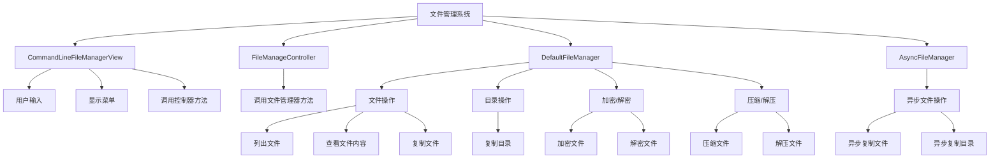
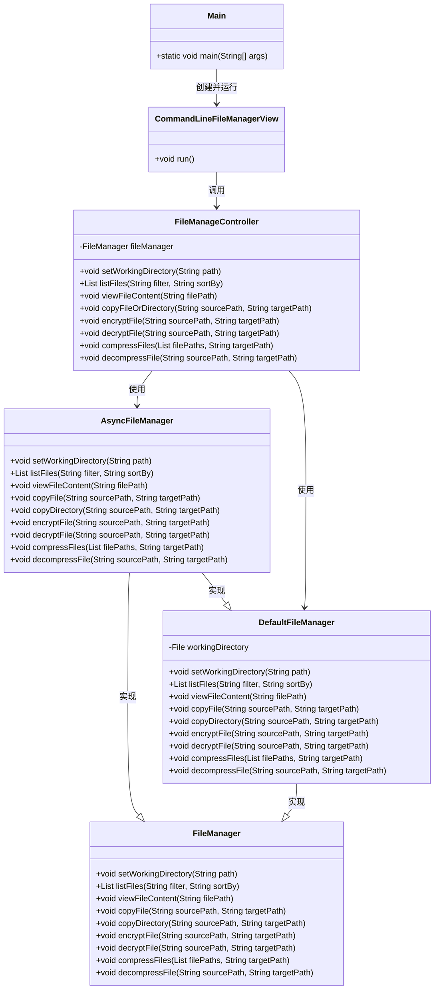
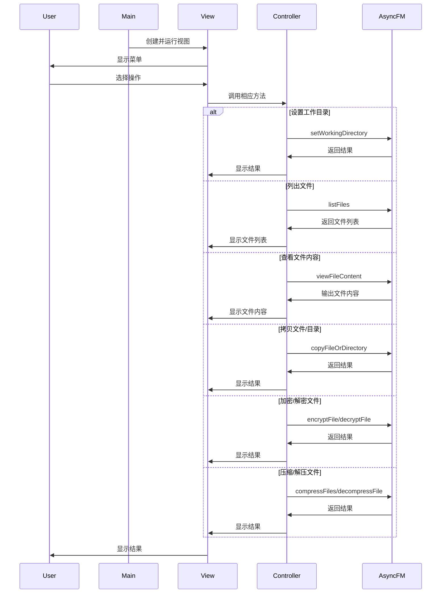

```mermaid
graph TD
    A[文件管理系统] --> B[CommandLineFileManagerView]
    A --> C[FileManageController]
    A --> D[DefaultFileManager]
    A --> E[AsyncFileManager]

    B --> F[用户输入]
    B --> G[显示菜单]
    B --> H[调用控制器方法]

    C --> I[调用文件管理器方法]

    D --> J[文件操作]
    D --> K[目录操作]
    D --> L[加密/解密]
    D --> M[压缩/解压]

    E --> N[异步文件操作]

    J --> O[列出文件]
    J --> P[查看文件内容]
    J --> Q[复制文件]

    K --> R[复制目录]

    L --> S[加密文件]
    L --> T[解密文件]

    M --> U[压缩文件]
    M --> V[解压文件]

    N --> W[异步复制文件]
    N --> X[异步复制目录]

```

```mermaid
classDiagram
    class Main {
        +static void main(String[] args)
    }

    class CommandLineFileManagerView {
        +void run()
    }

    class FileManageController {
        -FileManager fileManager
        +void setWorkingDirectory(String path)
        +List<File> listFiles(String filter, String sortBy)
        +void viewFileContent(String filePath)
        +void copyFileOrDirectory(String sourcePath, String targetPath)
        +void encryptFile(String sourcePath, String targetPath)
        +void decryptFile(String sourcePath, String targetPath)
        +void compressFiles(List<String> filePaths, String targetPath)
        +void decompressFile(String sourcePath, String targetPath)
    }

    class FileManager {
        +void setWorkingDirectory(String path)
        +List<File> listFiles(String filter, String sortBy)
        +void viewFileContent(String filePath)
        +void copyFile(String sourcePath, String targetPath)
        +void copyDirectory(String sourcePath, String targetPath)
        +void encryptFile(String sourcePath, String targetPath)
        +void decryptFile(String sourcePath, String targetPath)
        +void compressFiles(List<String> filePaths, String targetPath)
        +void decompressFile(String sourcePath, String targetPath)
    }

    class AsyncFileManager {
        +void setWorkingDirectory(String path)
        +List<File> listFiles(String filter, String sortBy)
        +void viewFileContent(String filePath)
        +void copyFile(String sourcePath, String targetPath)
        +void copyDirectory(String sourcePath, String targetPath)
        +void encryptFile(String sourcePath, String targetPath)
        +void decryptFile(String sourcePath, String targetPath)
        +void compressFiles(List<String> filePaths, String targetPath)
        +void decompressFile(String sourcePath, String targetPath)
    }

    class DefaultFileManager {
        -File workingDirectory
        +void setWorkingDirectory(String path)
        +List<File> listFiles(String filter, String sortBy)
        +void viewFileContent(String filePath)
        +void copyFile(String sourcePath, String targetPath)
        +void copyDirectory(String sourcePath, String targetPath)
        +void encryptFile(String sourcePath, String targetPath)
        +void decryptFile(String sourcePath, String targetPath)
        +void compressFiles(List<String> filePaths, String targetPath)
        +void decompressFile(String sourcePath, String targetPath)
    }

    Main --> CommandLineFileManagerView : 创建并运行
    CommandLineFileManagerView --> FileManageController : 调用
    FileManageController --> AsyncFileManager : 使用
    FileManageController --> DefaultFileManager : 使用
    AsyncFileManager --|> FileManager : 实现    
    AsyncFileManager --|> DefaultFileManager : 实现
    DefaultFileManager --|> FileManager : 实现


```

```mermaid
sequenceDiagram
    participant User
    participant Main


    Main ->> View: 创建并运行视图
    View ->> User: 显示菜单
    User ->> View: 选择操作
    View ->> Controller: 调用相应方法
    alt 设置工作目录
        Controller ->> AsyncFM: setWorkingDirectory
        AsyncFM ->> Controller: 返回结果
        Controller ->> View: 显示结果
    else 列出文件
        Controller ->> AsyncFM: listFiles
        AsyncFM ->> Controller: 返回文件列表
        Controller ->> View: 显示文件列表
    else 查看文件内容
        Controller ->> AsyncFM: viewFileContent
        AsyncFM ->> Controller: 输出文件内容
        Controller ->> View: 显示文件内容
    else 拷贝文件/目录
        Controller ->> AsyncFM: copyFileOrDirectory
        AsyncFM ->> Controller: 返回结果
        Controller ->> View: 显示结果
    else 加密/解密文件
        Controller ->> AsyncFM: encryptFile/decryptFile
        AsyncFM ->> Controller: 返回结果
        Controller ->> View: 显示结果
    else 压缩/解压文件
        Controller ->> AsyncFM: compressFiles/decompressFile
        AsyncFM ->> Controller: 返回结果
        Controller ->> View: 显示结果
    end
    View ->> User: 显示结果

```